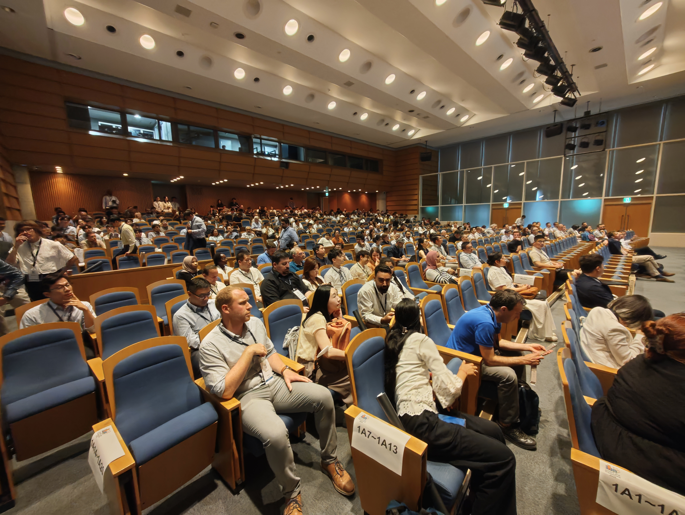
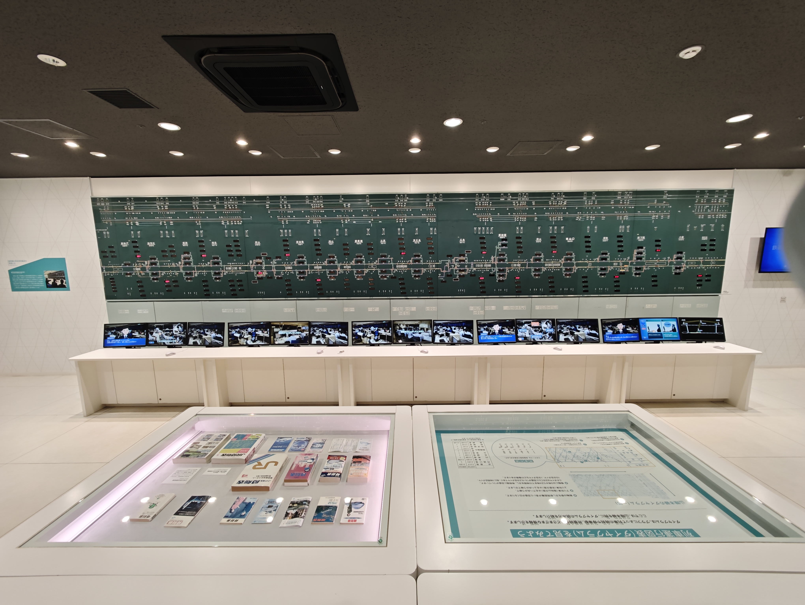

# Overview

Kyoto, a city steeped in history and culture, was the perfect destination for my first academic conference and my first trip to Japan.
The event was held at the Kyoto University, a leading institution in transportation engineering.
As one of the most renowned conferences in the field, it attracted experts and scholars from around the world.

I was honored to present my research on individual mobility modeling in metro systems, aiming to improve public transportation operations and enhance personal service quality.
In addition to my poster presentation, I attended various speeches and poster sessions, gaining valuable insights into the latest research and trends.

Beyond the academic activities, I took time to explore the beautiful city of Kyoto.
I visited historical sites, museums, and natural attractions such as Kiyomizudera Temple, Kyoto Railway Museum, and Togetsukyo Bridge.
I also enjoyed the local cuisine, sampling dishes like ramen and taiyaki. 
The bento meals from convenience stores were especially memorable for their taste and convenience during my busy schedule.

My journey to Japan began with a flight from Pudong International Airport to Kansai International Airport, followed by a smooth train ride to Kyoto.
I returned to China via the same route.

_Route from Shanghai to Kyoto via Osaka._

Overall, this first trip to Kyoto was a memorable experience that combined academic growth with cultural exploration.
Below are a few highlights from my journey.

# Highlights

## Academic Presentation

_At the main gate of Kyoto University._

_The iconic Clock Tower Centennial Hall at Kyoto University._

_Opening Ceremony of the conference in the main hall._

## Cultural Exploration

_Kiyomizudera, Kyoto's most famous temple and a UNESCO World Heritage Site._

_Standing beneath the torii gates at Fushimi Inari Taisha._

_The alameda near Togetsukyo Bridge._

_Train dispatch desk model at the Kyoto Railway Museum._

_Taiyaki, a popular Japanese fish-shaped cake filled with sweet red bean paste._

_The delicious ramen I enjoyed in Kyoto._

## Transportation Experience

_Kansai-Airport Express “HARUKA” connecting Osaka and Kyoto._

_Automatic Fare Collection system in the Kyoto Metro._
